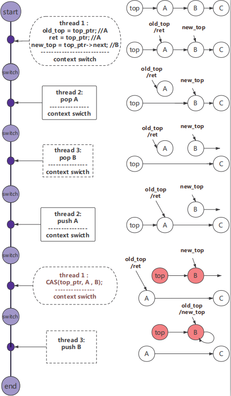

# Lock-free stack 

QEMU translates <a href = https://en.wikipedia.org/wiki/Load-link/store-conditional>Load-Link/Store-Conditional(LL/SC)</a> to test-test-and-set using CAS, resulting in potential <a href = https://en.wikipedia.org/wiki/ABA_problem>ABA problem</a>.  
This naive lock-free stack is written in **arm** assembly to provide api that can be used in C/C++.

**This program is deliberatly designed to crash at ABA problems.**


### What does the program do

This test first initialize an Arm lockfree stack. 
Then it creates threads to repeatedly do pop and push to the top of the stack, using ABA-safe LL/SC.
At last, the program check if the stack is not smashed: there are still the same elements in a different order.
If so, the ABA test succeeds, else there are ABA problems.

Ideally, the stack elements wouldn't change after these concurrent pops and pushes.
You can check it by using an Arm native machine to run this.
However, if you run it with QEMU, who doesn't emulate LL/SC correctly, and let many threads running at the same time
(which means you have to increase your loop number to make sure they are running concurrently), the stack would be smashed.



This is hard to understand at first.
If you're interested in details, please read our paper *Enhancing Atomic Instruction Emulation for Cross-ISA Dynamic Binary Translation* in CGO 2021.


### Build

```
make
```
### Run

```
Usage: ./lockfree-stack -t <threads number> -l <loop number>.
```

#### Example run using QEMU: 
```
$ qemu-arm ./lockfree-stack -t 8 -l 1000000
Running with 8 threads for 1000000 times.program starts, stack top = 0x82518
pop val = 0x82518
===============Printing stack...=============
node 0x82508 data 18 next 0x824f8
node 0x824f8 data 17 next 0x824e8
node 0x824e8 data 16 next 0x824d8
node 0x824d8 data 15 next 0x824c8
node 0x824c8 data 14 next 0x824b8
node 0x824b8 data 13 next 0x824a8
node 0x824a8 data 12 next 0x82498
node 0x82498 data 11 next 0x82488
node 0x82488 data 10 next 0x82478
node 0x82478 data 9 next 0x82468
node 0x82468 data 8 next 0x82458
node 0x82458 data 7 next 0x82448
node 0x82448 data 6 next 0x82438
node 0x82438 data 5 next 0x82428
node 0x82428 data 4 next 0x82418
node 0x82418 data 3 next 0x82408
node 0x82408 data 2 next (nil)
===============Creating threads=============
thread starts, tid = 27015
thread starts, tid = 27016
thread starts, tid = 27017
thread starts, tid = 27018
thread starts, tid = 27020
thread starts, tid = 27019
thread starts, tid = 27021
thread starts, tid = 27022
thread ends, tid = 27015
thread ends, tid = 27016
thread ends, tid = 27017
thread ends, tid = 27020
thread ends, tid = 27019
thread ends, tid = 27022
thread ends, tid = 27018
thread ends, tid = 27021
===============Printing stack...=============
node 0x824b8 data 13 next 0x824b8
p == p->next. Stack is smashed.
```

#### Example run in native Arm:
```
$ ./lockfree-stack -t 8 -l 2000000  
Running with 8 threads for 2000000 times.program starts, stack top = 0x82518
pop val = 0x82518
===============Printing stack...=============
node 0x82508 data 18 next 0x824f8
node 0x824f8 data 17 next 0x824e8
node 0x824e8 data 16 next 0x824d8
node 0x824d8 data 15 next 0x824c8
node 0x824c8 data 14 next 0x824b8
node 0x824b8 data 13 next 0x824a8
node 0x824a8 data 12 next 0x82498
node 0x82498 data 11 next 0x82488
node 0x82488 data 10 next 0x82478
node 0x82478 data 9 next 0x82468
node 0x82468 data 8 next 0x82458
node 0x82458 data 7 next 0x82448
node 0x82448 data 6 next 0x82438
node 0x82438 data 5 next 0x82428
node 0x82428 data 4 next 0x82418
node 0x82418 data 3 next 0x82408
node 0x82408 data 2 next (nil)
===============Creating threads=============
thread starts, tid = 27432
thread starts, tid = 27433
thread starts, tid = 27434
thread starts, tid = 27435
thread starts, tid = 27436
thread starts, tid = 27437
thread starts, tid = 27438
thread starts, tid = 27439
thread ends, tid = 27434
thread ends, tid = 27433
thread ends, tid = 27432
thread ends, tid = 27435
thread ends, tid = 27436
thread ends, tid = 27437
thread ends, tid = 27438
thread ends, tid = 27439
===============Printing stack...=============
node 0x824f8 data 17 next 0x82508
node 0x82508 data 18 next 0x824e8
node 0x824e8 data 16 next 0x824d8
node 0x824d8 data 15 next 0x824c8
node 0x824c8 data 14 next 0x824b8
node 0x824b8 data 13 next 0x824a8
node 0x824a8 data 12 next 0x82498
node 0x82498 data 11 next 0x82488
node 0x82488 data 10 next 0x82478
node 0x82478 data 9 next 0x82468
node 0x82468 data 8 next 0x82458
node 0x82458 data 7 next 0x82448
node 0x82448 data 6 next 0x82438
node 0x82438 data 5 next 0x82428
node 0x82428 data 4 next 0x82418
node 0x82418 data 3 next 0x82408
node 0x82408 data 2 next (nil)
program ends, stack top = 0x824f8
ABA problem test passed!

```


### Related

Section 4.3 of <a href = http://www.cs.columbia.edu/~luca/research/cota_CGO17.pdf>Cross-ISA Machine Emulation for Multicores</a>

Atomics section of <a href = https://lwn.net/Articles/697265/>Multi-threaded emulation for QEMU</a>
